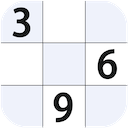

## Welcome to yutianjian’s Website

### Feel free to mail me: yu_tian_jian@163.com   or   yu_tian_jian@sina.cn

#### [欢迎访问我的中文网页](https://yu-tian-jian.github.io)

### My iOS ans macOS Apps 

My iOS and macOS Apps include: 

(1) Bridge Exercises

(2) Bridge PBN Viewer & Maker

(3) Bridge Team Score

(4) Bridge Pairs Score

(5) Bridge Score Calculator

(6) SUPERB CHESS BOARD (macOS),  SUPER CHESS BOARD (iOS)

(7) Improve your chess skill (macOS), Improve your chess (iOS)

(8) Sudoku Baron

(9) IPTV Player [IPTV Player Support Website](https://tvplayersupport.github.io/IPTVPlayerSupport/)

(10) Family Cashflow

(11) iNotebook

(12) Classic snake final

### My tvOS Apps

My tvOS apps include: Bridge Exercise, fast IPTV Player, etc.

### My Android Apps

My Android Apps (Google play App Store) include: 

(1) Practice Your Bridge, it is same with the iOS app Bridge Exercises.

(2) Bridge PBN Viewer and Maker.

(3) Bridge Score Calculator, it's a tool for Bridge player.

(4) Gobang (Renju, five-in-a-row, Gomoku)

(5) iGo

(6) Chess PGN Viewer

## (1) Bridge Exercises

It includes iOS, macOS and tvOS version.

Its free version is Bridge Exercises Lite, with the same function but it contains ad.

It‘s for you to practice bridge, and provide you a lot of classic hands to better understand bridge basic play, it includes:
A good bridge declarer relies on a variety of skills, strategies and techniques, it helps you practice more. 

It's NOT a on-line game, does NOT need internet.

It's simply a bridge table that you can learn bridge technique, train yourselves, enjoy bridge master's skills at anytime and anywhere, and a perfect product for you to improve your playing skills.

### (a) Bridge Exercises

It offers tons of declarer play exercises for players of all skill levels to practice playing skills. 
Level evaluation:

1 star: Winning ratio less than 50%

2 star: Winning ratio more than 50% and leas than 60%

3 star: Winning ratio more than 60% and leas than 70%

4 star: Winning ratio more than 70% and leas than 80%

5 star: Winning ratio more than 80%

### (b) Bridge Basic Play

It SHOWs you a lot of classic hands played by the famous bridge masters with comments to illustrate the various techniques for you to improve your playing skills.
The classic hands include safety play, removing play, block and unblock, killing defense, extra chance, etc, which covers all declarer and defense basic playing skills. 

If you go through all hands with a moment thinking, it would be a noticeable improvement in your playing skill.

Tips for you:
Don't play to the first trick too quickly. Force yourself to stop and think.
Concentrate on the opening lead for a few seconds so you'll remember it later. Decide what it tells you about the leader's length or strength in that suit.
Review the bidding. If one of your opponents has bid, try to come up with a general picture of his point-count and his length in the suit bid.
Always Count your losers and winners.

Hope you become a very good player and have many bridge fun days.

### (c) Bridge Best Hand of The Year

a) The Best Played Hand of the Year (1974-2019)

b) The Best Defence of the Year(1985-2019)

c) The Best Play by a Junior(1996-2019)

d) The BOLS Brilliancy Prize(1977-1987)

e) The Best Play of the Year by a Woman(1985-1986)

### (d) Bridge Bermuda Bowl

It includes (Both Open and Close Room) :
1955, 1957, 1959, 1962, 1967, 1973, 1974, 1975, 1977, 1979, 1981, 1983, 1987, 1991, 1995, 1997, 
2000, 2001, 2003, 2005, 2007, 2009, 2011, 2013, 2015, 2017 Bermuda Bowl Final.

### (e) Easy Bridge

When and where you want to play Bridge, take it Easy. 
Just for fun.

### (f) My Bridge Hands

After setting contract info, you can deal cards manually, then play and save them.

When you see a memorable play or good hands in one web, or in a game, or in a magazine, newspaper, you can play it in your device, enjoy it at any time.

## (2) Bridge PBN Viewer & Maker

Versions for iPad/iPhone and iMac.

Portable Bridge Notation (PBN)

Bridge PBN Viewer
PBN is a universal notation to represent bridge games. It can be used in every bridge program for dealing, bidding, playing, and/or teaching. The notation is suitable for all computer platforms.
There are a lot of Bridge PBN files in websites, You can use Bridge PBN Viewer to read them.

Bridge PBN Maker 
You can create and export your own Bridge PBN files with Bridge PBN Maker, you can save the result of a game as well as specify rules for dealing, bidding, playing, which allows you enjoy the game whenever you want. 

Features

1) Multiple games per PBN file.

2) Displaying PBN Game Contents.

3) Visualizing Bridge cards Moves From Notation.

4) Create and export Bridge PBN files.

## (3) Bridge team score

Support for duplicate bridge scoring (Round Robin):

(1) maximum team number: 22

(2) 25 Rounds: form 1 to 25

(3) 12 Rounds Quarterfinal: segment 1-12

(4) 12 Rounds Semifinal: segment 1-12

(5) 12 Rounds Final: segment 1-12 

(6) Sum score for each Round/QF/SF/Final

(7) Cross table for Round/QF/SF/Final

(8) 2012 WBF Continuous VP Scale

(9) IMP table

(10) Printing support.

(11) No of board 6/7/8/9/10/12/14/16/20/32

IMP - International Match Point

VP - Victory Point (2012 WBF Continuous VP Scale)

## (4) Bridge Pairs Score

Support Standard Mitchell Movements bridge scoring:

(1) Maximum Group number: 6

(2) Maximum Table number for each group: 20

(3) Maximum Board number for each round: 6

(4) Maximum Total Board number: 20*6 = 120

(5) Enter Score By Round 

(6) Show MP Score and Adjust

(7) Show Score of Each Team

(8) Show Sum Score 

(9) Rank: 

Double Championships By Group 

Double Championships By All

Single Championships By Group

Single Championships By All

(10) Printing.
 
## (5) Bridge score calculator

Versions for iMac.

Bridge score calculator for bridge scoring when you play bridge.

## (6) SUPERB CHESS BOARD

SUPERB CHESS BOARD is macOS Version, SUPER CHESS BOARD is for iPad/iPhone (iOS).

SUPERB CHESS BOARD is a iMac application which allows you to view and create PGN format chess games and visualizes moves from its notation. 

It has training mode. It can open variations of other moves.

You can create and save your own chess PGN files with PGN Maker. 

App can Show comments if the PGN file including comments, and Insert comments when you create PGN file.

Features

1) Multiple games per PGN file.
2) Displaying PGN Game Contents.
3) Visualizing Chess Moves From Notation. It also can open variations of other moves.
4) Training Mode.
5) Flip board and change board color.
6) Paste Move History string into the textview,  then visualizes moves, and save the string.
7)  Create and save your own chess PGN files.
8)  Support edit chess position for ending game.
9) Show comments if the PGN file including comments.
10) Insert comments when you create PGN file.
11)  App includes thousands of game collection.

## (7) Improve your chess skill / Improve your chess

Improve your chess skill is for macOS,  Improve your chess is for iOS.

Learning to spot mates is the simplest way to improve your chess and win more games. 
Players often miss opportunities involving unusual mates because it's easy to overlook something that is unfamiliar. 
The wide range of exercises will help increase your repertoire of mating pat­terns and give you a better chance of mating your next opponent! 

Enjoy solving these wonderful deadly checkmates puzzles, checking the solutions and totalling your points. 

## (8) Sudoku Baron

Versions for iPad/iPhone and iMac.

Sudoku objective: fill 9x9 grid with digits so that each column, row, and the nine 3x3 sub grids contains all of the digits from 1 to 9.

1) Easy, medium, and hard levels.

2) Hint.

3) Notes.

## (9) IPTV Player

IPTV Player, Watch television on your iMac or MBP.

Please access [IPTV Player Support Website](https://tvplayersupport.github.io/IPTVPlayerSupport/)

## (10) Family Cashflow

Versions for iPad/iPhone and iMac.

Family Cashflow shows the family macro-balance of income and expenses, to provide overall visual information for you to make your family fiscal policies.

Family Cashflow includes summary, common, husband, wife and children five pages to show that the overall balance of income and expenses of the family. 

For making daily records easier, Income will be classified as one kind, expenses is divided into three kind, large(>1000), medium(100)

## (11) iNotebook

Versions for iPad/iPhone and iMac.

Only one's mind is real. Strictly speaking, appearance is nothing but a mask. Real man is in himself.

Record your life, your work, and your feelings, write down all with iAnyNote.
iAnyNote lets you note everything you want, ideas, diary, to do list, VIP information, footmark whenever you travel all over the world. 

Memo : for your idea, to do list, meeting agenda, scheduled work, shopping list, and anything you want to note.

Diary: May be you do not write your diary for a long time, but it's important for you. What are you thinking, how do you feel, what is happening in your life? Diary will help you remember some special days, feelings in detail.

VIP: Some one is very important for your business, work or life, you can record his or her information here.

Footmark: May be you are a travel lover, and have been visited many places in the world. Now you can note your footmarks here, country visited, city visited, arrival time, hotel, sites visited and your visiting feelings.

## (12) Classic snake final

Versions for iMac.

Eat foods, grow longer and fatter.

Functions:

(1) Change background and snake color.

(2) Fullscreen.

(3) Walls around board.

(4) Speed setting.
